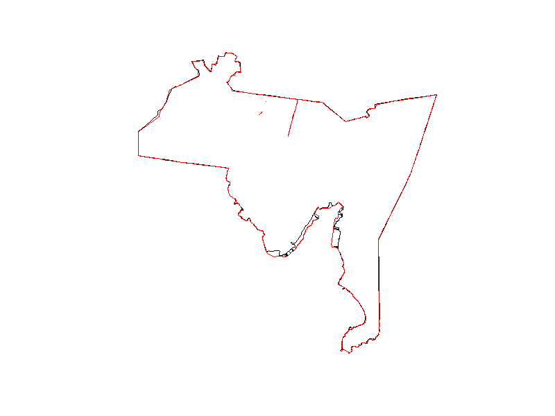

# newhaven_csi
Remake of the Community Severance Index for New Haven, Connecticut. Methodology based on *Development of a community severance index for urban areas in the United States: A case study in New York City* (Benavides et al, 2024) ([journal article](https://www.sciencedirect.com/science/article/pii/S0160412024001120?ref=pdf_download&fr=RR-2&rr=9387bb57b9c37f56), [GitHub repository](https://github.com/jaime-benavides/community_severance_nyc?tab=readme-ov-file)).

## Developments
- 05/07/2025
  - Apply standard `scale` (mean = 0; sd = 1) to CSI variables.
    - Original scaled only based on `sd` of each variable and did not account for `mean`, which caused poor performance in the PCP dimensionality reduction.
    - Update retains 3 `RM`, accounting for 95% of variable variance
    - See `a_09_merge.R` Line 76 for updated scale and `b_01_calc_csi.R` Line 207 for output.
```
> fa_csi
Factor Analysis using method =  minres
Call: psych::fa(r = list_rrmc_opt$L, nfactors = ., n.obs = num_n, rotate = "varimax",
    scores = "regression")
Standardized loadings (pattern matrix) based upon correlation matrix
                              MR1   MR3   MR2   h2       u2 com
autom_netw_dens              0.14  0.99  0.04 1.00 -0.00297 1.0
autom_inters_dens            0.20  0.95  0.23 0.99  0.01075 1.2
barrier_factor_osm           0.88 -0.10  0.39 0.93  0.06530 1.4
barrier_factor_faf5          0.76  0.43  0.47 0.99  0.00630 2.3
motorway_prox                0.72  0.63 -0.20 0.95  0.04954 2.1
primary_prox                 0.97  0.24  0.02 1.00  0.00057 1.1
secondary_prox               0.60  0.17  0.69 0.87  0.13231 2.1
trunk_prox                   0.77  0.54  0.22 0.94  0.06260 2.0
interstate_highway_prox      0.53  0.34  0.38 0.54  0.45806 2.6
freeways_expressways_prox    0.71  0.67  0.00 0.94  0.05798 2.0
other_princ_arter_prox       0.97  0.22  0.06 1.00  0.00317 1.1
tertiary_prox                0.96  0.19  0.23 1.00 -0.00358 1.2
residential_prox             0.16 -0.09  0.97 0.98  0.02400 1.1
aadt_esri_point              0.53  0.83  0.10 0.97  0.03010 1.7
aadt_fhwa_segm               0.01  0.88  0.37 0.92  0.08381 1.4
co2_emis_per_m2              0.39  0.87  0.29 1.00 -0.00144 1.6
pedest_netw_dens            -0.06  0.31  0.93 0.97  0.03339 1.2
street_no_autom_inters_dens  0.25  0.45  0.86 0.99  0.00589 1.7
NatWalkInd                   0.49  0.64  0.57 0.98  0.02471 2.9

                       MR1  MR3  MR2
SS loadings           7.23 6.43 4.30
Proportion Var        0.38 0.34 0.23
Cumulative Var        0.38 0.72 0.95
Proportion Explained  0.40 0.36 0.24
Cumulative Proportion 0.40 0.76 1.00

Mean item complexity =  1.7
Test of the hypothesis that 3 factors are sufficient.

df null model =  171  with the objective function =  319.67 with Chi Square =  30954.29
df of  the model are 117  and the objective function was  255.02

The root mean square of the residuals (RMSR) is  0.03
The df corrected root mean square of the residuals is  0.04

The harmonic n.obs is  105 with the empirical chi square  34.53  with prob <  1
The total n.obs was  105  with Likelihood Chi Square =  24184.1  with prob <  0

Tucker Lewis Index of factoring reliability =  -0.167
RMSEA index =  1.4  and the 90 % confidence intervals are  1.391 NA
BIC =  23639.58
Fit based upon off diagonal values = 1
Measures of factor score adequacy
                                                   MR1  MR3  MR2
Correlation of (regression) scores with factors   1.00 1.00 0.99
Multiple R square of scores with factors          0.99 0.99 0.99
Minimum correlation of possible factor scores     0.98 0.98 0.98
```

  - Calculate CSI using weighted mean of `MR1`, `MR2`, and `MR3` scores for each census block group.
    - By updating the `scale` method of input values, PCP identifies 3 `MR` which account for 95% of the variance.
    - CSI is calculated by multiplying the weight of each `MR` (ie. the % variance it explains) by the score, and summing for each census block group.
    - Output object contains this "raw" CSI value (`$csi`), as well as normalized (`$csi_normal`) , and normalized values * 100 for interpretability (`$cs_100`)
  
```
> df_scores[, c("csi", "csi_normal", "csi_100")]
# A tibble: 105 × 3
        csi csi_normal csi_100
      <dbl>      <dbl>   <dbl>
 1  0.00259     0.159    15.9
 2  0.0656      0.176    17.6
 3 -0.159       0.118    11.8
 4  0.192       0.208    20.8
 5 -0.379       0.0618    6.18
 6 -0.126       0.127    12.7
 7 -0.351       0.0689    6.89
 8 -0.269       0.0900    9.00
 9 -0.311       0.0792    7.92
10  0.364       0.252    25.2
# ℹ 95 more rows
# ℹ Use `print(n = ...)` to see more rows
```

- 05/01/2025
  - Change spatial context from New Haven neighborhoods shapefile with `sf::st_union` to town boundary shapefile sourced from Connecticut DEEP ArcGIS archive (https://deepmaps.ct.gov/datasets/CTDEEP::connecticut-and-vicinity-town-boundary-set/about?layer=1).
  - When plotted, the unioned neighborhoods (red) have a different border than the town boundary (black), which would result in a different spatial context and different values for interpolation to census block groups and calculation of environmental variables.

  - Direct query to OpenStreetMaps with post filtering instead of SQL filter at query time.

## scripts/
`a_00_initiate.R`
- Install and load required packages.
- Set home and input/output directories and Connecticut-specific coordinate reference system.
- Source at the beginning of each run script `source("scripts/a_00_initate.R")`

`a_01_prep_sld.R`
- Prepare spatial data from Smart Location Database.
- Input(s): `data/input/SmartLocationDatabase.gbd`
- Output(s): `data/output/a_01/sf_sld_variables_proj.rds`, `data/output/a_01/df_sld.rds`

`a_02_prep_barrier.R`
- Prepare barrier factor variables.
- Input(s): `data/input/connecticut-latest.osm.pbf`, `data/input/FAF5Network/F5FNEWHAVEN.shp`
- Output(s): `data/output/a_02/sf_barrier_factors_nh.rds`

`a_03_query_traffic.R`
- Query US (AADT) and Connecticut (HPMS) traffic data from ESRI respoitories.
- Output(s): `data/output/a_03/sf_aadt_proj.rds`, `data/output/a_03/sf_ct_hpms_proj.rds`

`a_04_regrid_aadt.R`
- Regrid (interpolate) traffic intensity (counts) data to census block groups with local `regrid_ok()`.
- Input(s): `data/output/a_01/sf_sld_variables_proj.rds`, `data/output/a_03/sf_aadt_proj.rds`, `R/regrid_ok.R`
- Output(s): `data/output/a_04/sf_grid_nh.rds`, `data/output/a_04/sf_regrid_aadt_cbg.rds`

`a_05_regrid_hpms.R`
- Regrid (interpolate) traffic intensity (segements) data to census block groups with local `regrid_ok()`
- Input(s): `data/output/a_04/sf_grid_nh.rds`, `data/output/a_03/sf_ct_hpms_proj.rds`, `R/regrid_ok.R`
- Output(s): `data/output/a_05/sf_regrid_hpms_cbg.rds`

`a_06_prep_osm.R`
- Prepare OpenStreetMaps data.
- Output(s): `data/input/geofabrik_connecticut-latest.osm.pbf`, `data/input/geofabrik_connecticut-latest.gpkg`, `data/output/a_06/sf_osm_nh_filter.rds`

`a_07_calc_road.R`
- Calculate road infrastructure statistics for census block groups.
- Input(s): `data/output/a_04/sf_grid_nh.R`, `data/input/FAF5Network/F5F_NEWHAVEN.shp`, `data/output/a_06/sf_osm_nh_filter.rds`
- Output(s): `data/output/a_07/sf_grid_prox.rds`

`a_08_calc_emissions.R`
- Calculate traffic CO2 emissions per m^2 for census block groups.
- Input(s): `data/input/DARTE_v2.gdb`, `data/output/a_04/sf_grid_nh.rds`
- Output(s): `data/output/a_08/sf_co2_emis.rds`

`a_09_merge.R`
- Merge all census block group-level variables into a single object.
- Input(s): All `.rds` files generated in scripts `a_00` to `a_08`.
- Output(s): `data/output/a_09/sf_csi_scale.rds`, `data/output/a_09/df_csi_geoid_scale.rds`

`b_01_calc_csi.R`
- Calculate Community Severance Index (CSI) for New Haven census block groups.
- Input(s): `data/output/a_01/df_sld.rds`, `data/output/a_09/sf_csi_scale.rds`
- Output(s): `data/output/b_01/sf_csi_nh.rds`

`c_01_plot_csi.R`
- Plot CSI values for publication figures.

### dep/
- Deprecated `R` scripts which are not needed for analysis.
- Sensitivity analyses are not required for our analysis as the sensitivity analyses conducted in the original Benavides et al, 2024 paper were conducted to support the 19 included variables.
- Our analysis replicates the supported methodology and included variables and therefore does not need its own sensitivty supports.